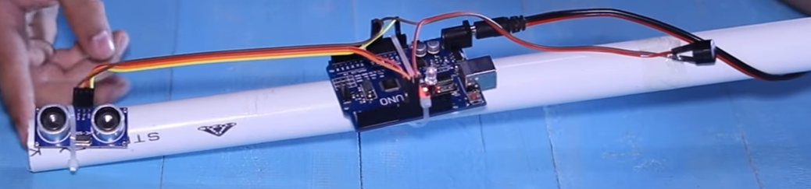

# Hardware

三个HC06蓝牙芯片作为beacon安装在四周

ESP8266+振动片+声波传感器+眼镜 = 声波探测眼镜

ESP8266+振动片+声波传感器+拐杖 = 声波探测拐杖

Three HC06 Bluetooth chips are installed as beacons around.

ESP8266 + vibrationr + ultrasonic sensor + glasses Frame = Ultrasonic detection glasses.

ESP8266 + vibration + ultrasonic sensor + long cane = Ultrasonic detection cane.

## Compomnents

